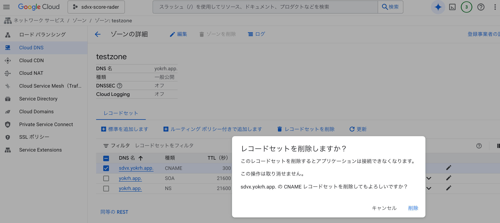

# terraform destroy log

performed on 2025.5.4.


## api

done

```sh
$ tf destroy
data.google_iam_policy.noauth: Refreshing state...
google_cloud_run_service.default: Refreshing state... [id=locations/asia-northeast1/namespaces/sdvx-score-rader/services/api-server]
google_cloud_run_service_iam_policy.noauth: Refreshing state... [id=v1/projects/sdvx-score-rader/locations/asia-northeast1/services/api-server]

An execution plan has been generated and is shown below.
Resource actions are indicated with the following symbols:
  - destroy

Terraform will perform the following actions:

  # google_cloud_run_service.default will be destroyed
  - resource "google_cloud_run_service" "default" {
      - autogenerate_revision_name = true -> null
      - id                         = "locations/asia-northeast1/namespaces/sdvx-score-rader/services/api-server" -> null
      - location                   = "asia-northeast1" -> null
      - name                       = "api-server" -> null
      - project                    = "sdvx-score-rader" -> null
      - status                     = [
          - {
              - conditions                   = [
                  - {
                      - message = ""
                      - reason  = ""
                      - status  = "True"
                      - type    = "Ready"
                    },
                  - {
                      - message = ""
                      - reason  = ""
                      - status  = "True"
                      - type    = "ConfigurationsReady"
                    },
                  - {
                      - message = ""
                      - reason  = ""
                      - status  = "True"
                      - type    = "RoutesReady"
                    },
                ]
              - latest_created_revision_name = "api-server-00002-ter"
              - latest_ready_revision_name   = "api-server-00002-ter"
              - observed_generation          = 2
              - url                          = "https://api-server-n62smewrva-an.a.run.app"
            },
        ] -> null

      - metadata {
          - annotations      = {
              - "client.knative.dev/user-image"     = "gcr.io/sdvx-score-rader/api-server"
              - "run.googleapis.com/client-name"    = "gcloud"
              - "run.googleapis.com/client-version" = "295.0.0"
              - "run.googleapis.com/operation-id"   = "35e00f4d-ec81-420c-a9fd-65a9bddbc7d1"
              - "run.googleapis.com/urls"           = jsonencode(
                    [
                      - "https://api-server-107846556544.asia-northeast1.run.app",
                      - "https://api-server-n62smewrva-an.a.run.app",
                    ]
                )
              - "serving.knative.dev/creator"       = "sdvx-score-rader-sa-api@sdvx-score-rader.iam.gserviceaccount.com"
              - "serving.knative.dev/lastModifier"  = "107846556544@cloudbuild.gserviceaccount.com"
            } -> null
          - generation       = 2 -> null
          - labels           = {
              - "cloud.googleapis.com/location" = "asia-northeast1"
            } -> null
          - namespace        = "sdvx-score-rader" -> null
          - resource_version = "AAWoceXuDyA" -> null
          - self_link        = "/apis/serving.knative.dev/v1/namespaces/107846556544/services/api-server" -> null
          - uid              = "0600eb29-0020-44a7-985b-7d9c90096f7e" -> null
        }

      - template {
          - metadata {
              - annotations = {
                  - "autoscaling.knative.dev/maxScale"  = "1000"
                  - "client.knative.dev/user-image"     = "gcr.io/sdvx-score-rader/api-server"
                  - "run.googleapis.com/client-name"    = "gcloud"
                  - "run.googleapis.com/client-version" = "295.0.0"
                } -> null
              - generation  = 0 -> null
              - labels      = {
                  - "run.googleapis.com/startupProbeType" = "Default"
                } -> null
              - name        = "api-server-00002-ter" -> null
            }

          - spec {
              - container_concurrency = 80 -> null

              - containers {
                  - args    = [] -> null
                  - command = [] -> null
                  - image   = "gcr.io/sdvx-score-rader/api-server" -> null

                  - resources {
                      - limits   = {
                          - "cpu"    = "1000m"
                          - "memory" = "256Mi"
                        } -> null
                      - requests = {} -> null
                    }
                }
            }
        }

      - traffic {
          - latest_revision = true -> null
          - percent         = 100 -> null
        }
    }

  # google_cloud_run_service_iam_policy.noauth will be destroyed
  - resource "google_cloud_run_service_iam_policy" "noauth" {
      - etag        = "BwWocYcLZUU=" -> null
      - id          = "v1/projects/sdvx-score-rader/locations/asia-northeast1/services/api-server" -> null
      - location    = "asia-northeast1" -> null
      - policy_data = jsonencode(
            {
              - bindings = [
                  - {
                      - members = [
                          - "allUsers",
                        ]
                      - role    = "roles/run.invoker"
                    },
                ]
            }
        ) -> null
      - project     = "sdvx-score-rader" -> null
      - service     = "v1/projects/sdvx-score-rader/locations/asia-northeast1/services/api-server" -> null
    }

Plan: 0 to add, 0 to change, 2 to destroy.
```


## data

```sh
$ tf destroy
google_storage_bucket.data: Refreshing state... [id=sdvx-score-rader-data]

An execution plan has been generated and is shown below.
Resource actions are indicated with the following symbols:
  - destroy

Terraform will perform the following actions:

  # google_storage_bucket.data will be destroyed
  - resource "google_storage_bucket" "data" {
      - bucket_policy_only       = true -> null
      - default_event_based_hold = false -> null
      - force_destroy            = true -> null
      - id                       = "sdvx-score-rader-data" -> null
      - labels                   = {} -> null
      - location                 = "ASIA" -> null
      - name                     = "sdvx-score-rader-data" -> null
      - project                  = "sdvx-score-rader" -> null
      - requester_pays           = false -> null
      - self_link                = "https://www.googleapis.com/storage/v1/b/sdvx-score-rader-data" -> null
      - storage_class            = "STANDARD" -> null
      - url                      = "gs://sdvx-score-rader-data" -> null
    }

Plan: 0 to add, 0 to change, 1 to destroy.
```


## front

```sh
tf destroy
aws_route53_record.default: Refreshing state... [id=Z386I1AGT3K93F_score.sdvx.yokrh.com_CNAME]

An execution plan has been generated and is shown below.
Resource actions are indicated with the following symbols:
  - destroy

Terraform will perform the following actions:

  # aws_route53_record.default will be destroyed
  - resource "aws_route53_record" "default" {
      - fqdn    = "score.sdvx.yokrh.com" -> null
      - id      = "Z386I1AGT3K93F_score.sdvx.yokrh.com_CNAME" -> null
      - name    = "score.sdvx.yokrh.com" -> null
      - records = [
          - "sdvx-yokrh.netlify.app.",
        ] -> null
      - ttl     = 300 -> null
      - type    = "CNAME" -> null
      - zone_id = "Z386I1AGT3K93F" -> null
    }

Plan: 0 to add, 0 to change, 1 to destroy.
```


## sa-manager (service account)

```sh
$ tf destroy
google_service_account.sa_api: Refreshing state... [id=projects/sdvx-score-rader/serviceAccounts/sdvx-score-rader-sa-api@sdvx-score-rader.iam.gserviceaccount.com]
google_service_account.sa_data: Refreshing state... [id=projects/sdvx-score-rader/serviceAccounts/sdvx-score-rader-sa-data@sdvx-score-rader.iam.gserviceaccount.com]
google_project_iam_member.sa_data_storage: Refreshing state... [id=sdvx-score-rader/roles/storage.admin/serviceaccount:sdvx-score-rader-sa-data@sdvx-score-rader.iam.gserviceaccount.com]
google_service_account_key.sa_data_key: Refreshing state... [id=projects/sdvx-score-rader/serviceAccounts/sdvx-score-rader-sa-data@sdvx-score-rader.iam.gserviceaccount.com/keys/80d391b8614dec461d22c2da64064374c2f15810]
google_project_iam_member.sa_api_storage: Refreshing state... [id=sdvx-score-rader/roles/storage.objectViewer/serviceaccount:sdvx-score-rader-sa-api@sdvx-score-rader.iam.gserviceaccount.com]
google_service_account_key.sa_api_key: Refreshing state... [id=projects/sdvx-score-rader/serviceAccounts/sdvx-score-rader-sa-api@sdvx-score-rader.iam.gserviceaccount.com/keys/25cbca10961e3b170cf64cfa93c7c0821f5566bc]
google_project_iam_member.sa_api_cloud_run_service: Refreshing state... [id=sdvx-score-rader/roles/serverless.serviceAgent/serviceaccount:sdvx-score-rader-sa-api@sdvx-score-rader.iam.gserviceaccount.com]
google_project_iam_member.sa_api_cloud_run: Refreshing state... [id=sdvx-score-rader/roles/run.admin/serviceaccount:sdvx-score-rader-sa-api@sdvx-score-rader.iam.gserviceaccount.com]

An execution plan has been generated and is shown below.
Resource actions are indicated with the following symbols:
  - destroy

Terraform will perform the following actions:

  # google_project_iam_member.sa_api_cloud_run will be destroyed
  - resource "google_project_iam_member" "sa_api_cloud_run" {
      - etag    = "BwY0R3pY42A=" -> null
      - id      = "sdvx-score-rader/roles/run.admin/serviceaccount:sdvx-score-rader-sa-api@sdvx-score-rader.iam.gserviceaccount.com" -> null
      - member  = "serviceAccount:sdvx-score-rader-sa-api@sdvx-score-rader.iam.gserviceaccount.com" -> null
      - project = "sdvx-score-rader" -> null
      - role    = "roles/run.admin" -> null
    }

  # google_project_iam_member.sa_api_cloud_run_service will be destroyed
  - resource "google_project_iam_member" "sa_api_cloud_run_service" {
      - etag    = "BwY0R3pY42A=" -> null
      - id      = "sdvx-score-rader/roles/serverless.serviceAgent/serviceaccount:sdvx-score-rader-sa-api@sdvx-score-rader.iam.gserviceaccount.com" -> null
      - member  = "serviceAccount:sdvx-score-rader-sa-api@sdvx-score-rader.iam.gserviceaccount.com" -> null
      - project = "sdvx-score-rader" -> null
      - role    = "roles/serverless.serviceAgent" -> null
    }

  # google_project_iam_member.sa_api_storage will be destroyed
  - resource "google_project_iam_member" "sa_api_storage" {
      - etag    = "BwY0R3pY42A=" -> null
      - id      = "sdvx-score-rader/roles/storage.objectViewer/serviceaccount:sdvx-score-rader-sa-api@sdvx-score-rader.iam.gserviceaccount.com" -> null
      - member  = "serviceAccount:sdvx-score-rader-sa-api@sdvx-score-rader.iam.gserviceaccount.com" -> null
      - project = "sdvx-score-rader" -> null
      - role    = "roles/storage.objectViewer" -> null
    }

  # google_project_iam_member.sa_data_storage will be destroyed
  - resource "google_project_iam_member" "sa_data_storage" {
      - etag    = "BwY0R3pY42A=" -> null
      - id      = "sdvx-score-rader/roles/storage.admin/serviceaccount:sdvx-score-rader-sa-data@sdvx-score-rader.iam.gserviceaccount.com" -> null
      - member  = "serviceAccount:sdvx-score-rader-sa-data@sdvx-score-rader.iam.gserviceaccount.com" -> null
      - project = "sdvx-score-rader" -> null
      - role    = "roles/storage.admin" -> null
    }

  # google_service_account.sa_api will be destroyed
  - resource "google_service_account" "sa_api" {
      - account_id   = "sdvx-score-rader-sa-api" -> null
      - description  = "sdvx-score-rader SA" -> null
      - display_name = "Service account sdvx-score-rader-sa-api" -> null
      - email        = "sdvx-score-rader-sa-api@sdvx-score-rader.iam.gserviceaccount.com" -> null
      - id           = "projects/sdvx-score-rader/serviceAccounts/sdvx-score-rader-sa-api@sdvx-score-rader.iam.gserviceaccount.com" -> null
      - name         = "projects/sdvx-score-rader/serviceAccounts/sdvx-score-rader-sa-api@sdvx-score-rader.iam.gserviceaccount.com" -> null
      - project      = "sdvx-score-rader" -> null
      - unique_id    = "107900787078892290674" -> null
    }

  # google_service_account.sa_data will be destroyed
  - resource "google_service_account" "sa_data" {
      - account_id   = "sdvx-score-rader-sa-data" -> null
      - description  = "sdvx-score-rader SA" -> null
      - display_name = "Service account sdvx-score-rader-sa-data" -> null
      - email        = "sdvx-score-rader-sa-data@sdvx-score-rader.iam.gserviceaccount.com" -> null
      - id           = "projects/sdvx-score-rader/serviceAccounts/sdvx-score-rader-sa-data@sdvx-score-rader.iam.gserviceaccount.com" -> null
      - name         = "projects/sdvx-score-rader/serviceAccounts/sdvx-score-rader-sa-data@sdvx-score-rader.iam.gserviceaccount.com" -> null
      - project      = "sdvx-score-rader" -> null
      - unique_id    = "113784454391818082806" -> null
    }

  # google_service_account_key.sa_api_key will be destroyed
  - resource "google_service_account_key" "sa_api_key" {
      - id                 = "projects/sdvx-score-rader/serviceAccounts/sdvx-score-rader-sa-api@sdvx-score-rader.iam.gserviceaccount.com/keys/25cbca10961e3b170cf64cfa93c7c0821f5566bc" -> null
      - key_algorithm      = "KEY_ALG_RSA_2048" -> null
      - name               = "projects/sdvx-score-rader/serviceAccounts/sdvx-score-rader-sa-api@sdvx-score-rader.iam.gserviceaccount.com/keys/25cbca10961e3b170cf64cfa93c7c0821f5566bc" -> null
      - private_key        = (sensitive value)
      - private_key_type   = "TYPE_GOOGLE_CREDENTIALS_FILE" -> null
      - public_key         = "LS0tLS1CRUdJTiBDRVJUSUZJQ0FURS0tLS0tCk1JSUMvRENDQWVTZ0F3SUJBZ0lJUHkxWXcrc2ZNYVV3RFFZSktvWklodmNOQVFFRkJRQXdJREVlTUJ3R0ExVUUKQXhNVk1UQTNPVEF3TnpnM01EYzRPRGt5TWprd05qYzBNQ0FYRFRJd01EWXhPVEUxTWpRd05sb1lEems1T1RreApNak14TWpNMU9UVTVXakFnTVI0d0hBWURWUVFERXhVeE1EYzVNREEzT0Rjd056ZzRPVEl5T1RBMk56UXdnZ0VpCk1BMEdDU3FHU0liM0RRRUJBUVVBQTRJQkR3QXdnZ0VLQW9JQkFRQzBVeEtmdE9XNHpxaTFGRVBodSszMHIzVzcKQjZ0OXlYM2poZ0szNnBmenBobXlLWkpFdXpKN2grQVRxR1dLSjlQNG10MGtuejVuWEZkNS9qS0xtQS8vL05Ucwp2Q1dLV21yc2trY0ltZXlvZ01pK05oK2Zrd2I2UnZtb09EYkVIVklqUWZ5MThQME12RkZ3ZXppcEREeTdxMWsyCmNXNk1JYWkvRm9iSlpVVWhJMmFTSEY3d3U4ZnJSM2piNXJoUkN0YXRRcnViQW5Kd29UUG4vdGE5cU5zQUxlYnEKVnBpd0tqRFJ6emJFcHh4K3ZyWFBYU3hPZGVXRk1EeUJ4RnlZc1VQZG1YMHd3dSszY0xYUlJFN3RaMGlXazJqSQpQU0NFSHBtakZ5cjFNK3F3VFhmQmdEMzZJWGp4VHZFWlpRRVBleGlhdHk0WEFnMlJTQWZpR0FEaENDR0pBZ01CCkFBR2pPREEyTUF3R0ExVWRFd0VCL3dRQ01BQXdEZ1lEVlIwUEFRSC9CQVFEQWdlQU1CWUdBMVVkSlFFQi93UU0KTUFvR0NDc0dBUVVGQndNQ01BMEdDU3FHU0liM0RRRUJCUVVBQTRJQkFRQ21CVWVqVkZKMGordFFtdkdmRWIrQwpNeXZHSlRFMU9hQUtMVk9vVVVSWjhHeW9xUDhwQ25ydTQ3bzVoWEdpTmFEZVpBbVgrQ3VPRVdTS3hmSWtKMWpFCnFVK0w1RDVZUmRpYThZQ2hUTi9GTk42RnlSSUlWR0RzNHpyK2ZmOE45dndRWUwyVERuaWM0Um92TERONFoxT2sKUTdnR1V3RzlmWDRvUTNIZ2VGN1hERnZWbzEvR2J5RDMwTE1YRE9JdVU4alNhaUsvQzlIcHpqSEF0NmRwUk5KNwpLVi9PT0RaTzZIVzdQMnpYeDB0OWZwS2w1TFVzb29kUmR6cDdIV3ovK2l1KysrajNpWnhUeWM0blREL0lNdjZSCjlJZ0Q1cE9mTHlOOHdFbzFLc2UvTm5nNVIxNHp6UWVwdW13YzFHczI2RnczUHlYbzZ3dmFNdWc5VGl3cU03WWQKLS0tLS1FTkQgQ0VSVElGSUNBVEUtLS0tLQo=" -> null
      - public_key_type    = "TYPE_X509_PEM_FILE" -> null
      - service_account_id = "sdvx-score-rader-sa-api@sdvx-score-rader.iam.gserviceaccount.com" -> null
      - valid_after        = "2020-06-19T15:24:06Z" -> null
      - valid_before       = "9999-12-31T23:59:59Z" -> null
    }

  # google_service_account_key.sa_data_key will be destroyed
  - resource "google_service_account_key" "sa_data_key" {
      - id                 = "projects/sdvx-score-rader/serviceAccounts/sdvx-score-rader-sa-data@sdvx-score-rader.iam.gserviceaccount.com/keys/80d391b8614dec461d22c2da64064374c2f15810" -> null
      - key_algorithm      = "KEY_ALG_RSA_2048" -> null
      - name               = "projects/sdvx-score-rader/serviceAccounts/sdvx-score-rader-sa-data@sdvx-score-rader.iam.gserviceaccount.com/keys/80d391b8614dec461d22c2da64064374c2f15810" -> null
      - private_key        = (sensitive value)
      - private_key_type   = "TYPE_GOOGLE_CREDENTIALS_FILE" -> null
      - public_key         = "LS0tLS1CRUdJTiBDRVJUSUZJQ0FURS0tLS0tCk1JSUMrakNDQWVLZ0F3SUJBZ0lJSEVwaDlNa0xTa1F3RFFZSktvWklodmNOQVFFRkJRQXdJREVlTUJ3R0ExVUUKQXhNVk1URXpOemcwTkRVME16a3hPREU0TURneU9EQTJNQjRYRFRJd01EWXdNVEExTkRJd09Wb1hEVE13TURVegpNREExTkRJd09Wb3dJREVlTUJ3R0ExVUVBeE1WTVRFek56ZzBORFUwTXpreE9ERTRNRGd5T0RBMk1JSUJJakFOCkJna3Foa2lHOXcwQkFRRUZBQU9DQVE4QU1JSUJDZ0tDQVFFQWpsTDVNUTBqNHhEZGl3WXJ1VGpVaFgwWE1aUjgKTG1lek1sYk5FVVJwM2xubzhiWDdqNVJidXMwWDlCVWNrdTRZNDRXUGIyU2VBR0JyRFdyc1pTaVdHc0VzTitGMgpoT0RnaUFiblpMM1Z0LytjL0lWcHhtdXlUdmtvL3RlY1BDcHgyWXcyeU1XSVNTK2N1Z2hWOEZOZnRCSHAxb1pTCnd6ZlRyREl3RzZqb0Q0cTUxa0swenBQanp2aXVYUEZSYWF4WDdQc1R4Q3NNdXdMdFVLU1FWeTdObTk4SVNKb1EKdmJuSFBDdDMrV1JaSW5mUXZKMXBsRkRMQTh1ajlJQWJQcUpSNVBPSUpSempIVlFPUnBpdlJ6NjZuZWhkYmlReApua0ZCdWcrK0R4U0pDekFwT2duYmFKdHk3ZG1LM3pONzBUbm1WSENUd2k5VDhJbFN4eTg4S1ozR1pRSURBUUFCCm96Z3dOakFNQmdOVkhSTUJBZjhFQWpBQU1BNEdBMVVkRHdFQi93UUVBd0lIZ0RBV0JnTlZIU1VCQWY4RUREQUsKQmdnckJnRUZCUWNEQWpBTkJna3Foa2lHOXcwQkFRVUZBQU9DQVFFQURNakt3MGsySng1MUhBaDlNaHUrRGNpZwowRUw1ZmJJTDZqb012QWRZdW8xVzhLcHM0bkluaVZLN25TZm8zRElnT3hTbENnUUxOZEpmTDNiV1hCM3RGL040Clg0RDBkWVYydFdSY1ZQN0h0SGJ0bDdLcldsdnU0QWN6TTc1T0s5TGJkZW1IWnV3NkM4MTBxT0FZSGpheFdLQzUKQ29NN2NaY29QSW0vdWN2TUw3d09qVzMzZzVQVXJ4YVo4ZkhsYjBNc2gxTG5zcHNTOFowSlhVSzZMODhrMTZDSgphSWlHaXpaZUZHTENqTUwwaUpwNW54TUdTdjlEUFZ1OFJ4Uzd0TURhZHlFcm1qM2c5RXMrWjNTbyticFFudEl5CnJPNHM0b1ZSaTV3TXlsZXV1MG1KKzduUUQybFNWcDhjSnM5cjJvT2xwcWtXTm9wZXNBb01ycmorNms5UGVBPT0KLS0tLS1FTkQgQ0VSVElGSUNBVEUtLS0tLQo=" -> null
      - public_key_type    = "TYPE_X509_PEM_FILE" -> null
      - service_account_id = "sdvx-score-rader-sa-data@sdvx-score-rader.iam.gserviceaccount.com" -> null
      - valid_after        = "2020-06-01T05:42:09Z" -> null
      - valid_before       = "2030-05-30T05:42:09Z" -> null
    }

Plan: 0 to add, 0 to change, 8 to destroy.
```

## Others

### domain

deleted from https://console.cloud.google.com/net-services/dns/zones?inv=1&invt=Abwdbg&project=sdvx-score-rader



confirmed no Domain in https://account.squarespace.com/domains (former Google Domains).

### website

disable from Netlify. (not deleted)

https://app.netlify.com/teams/yokrh/sites

https://app.netlify.com/sites/sdvx-yokrh/configuration/general

### project

at last, deleted the project from GCP console.

https://console.cloud.google.com/cloud-resource-manager?project=sdvx-score-rader

found the typo rad'e'r when closing XD
